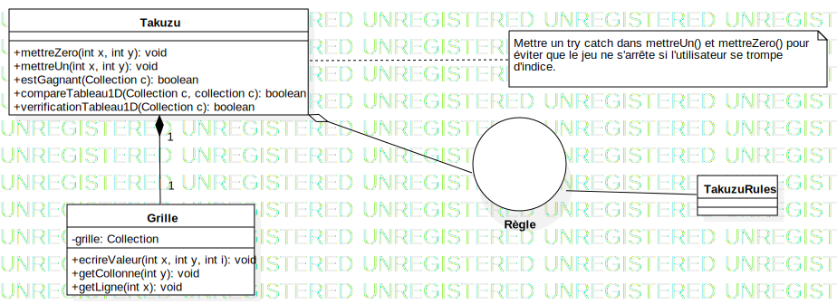

# Takuzu
Projet <a href="https://fr.wikipedia.org/wiki/Takuzu">Takuzu</a> tuteuré par <a href="http://www.lirmm.fr/~hisler/">Gaëlle Hisler</a>.

En collaboration avec Pierre-Antoine CHERON - Nassim EZZAMARI - Mathieu GRIMAUD - Tony NGUYEN.

<h2>Règle</h2>

Il peut s'agir de grilles allant de 6x6 à 14x14 en général, mais pouvant très bien avoir un nombre de colonnes et de lignes différent (voire différents entre eux pourvu qu'ils soient pairs). Chaque grille ne contient que des 0 et des 1, et doit être complétée en respectant trois règles :

<ul><li>autant de 1 et de 0 sur chaque ligne et sur chaque colonne&nbsp;;</li>
<li>pas plus de 2 chiffres identiques côte à côte&nbsp;;</li>
<li>2 lignes ou 2 colonnes ne peuvent être identiques.</li></ul>

<h2>Diagramme</h2>

