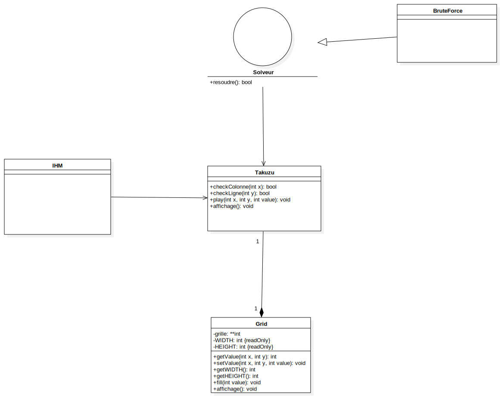

# Takuzu
Projet <a href="https://fr.wikipedia.org/wiki/Takuzu">Takuzu</a> tuteuré par <a href="http://www.lirmm.fr/~hisler/">Gaëlle Hisler</a>.

En collaboration avec Pierre-Antoine CHERON - Nassim EZZAMARI - Mathieu GRIMAUD - Tony NGUYEN.


## Règle

<p>
	Il peut s'agir de grilles allant de 6x6 à 14x14 en général, mais pouvant très bien avoir un nombre de colonnes et de lignes différent (voire différents entre eux pourvu qu'ils soient pairs). Chaque grille ne contient que des 0 et des 1, et doit être complétée en respectant trois règles :
</p>

<ul>
	<li>autant de 1 et de 0 sur chaque ligne et sur chaque colonne&nbsp;;</li>
	<li>pas plus de 2 chiffres identiques côte à côte&nbsp;;</li>
	<li>2 lignes ou 2 colonnes ne peuvent être identiques.</li>
</ul>

<h2>UML class diagram for Takuzu project by Pierre-Antoine</h2>



## Lancer le projet

requiert java

telecharger la derniere release dans la section dediee de github.
Executer le fichier en double cliquant dessus, si le systeme vous demande avec quel programme ouvrir choisissez Java.
ou en CLI:
```bash
java -jar "chemin du fichier.jar"
``` 

## Creer un executable
necessite javaFX, maven et Java.

dans le terminal se deplacer dans le dossier du projet puis dans le sous dossier Takuzu.

la commande: 
```bash
mvn package
```
permet de creer le fichier executable java (takuzu.jar) dans le dossier ./target

on peut ensuite le lancer avec la commande
```bash
java -jar "chemin du fichier.jar"
```
par exemple
```bash
java -jar ./target/takuzu.jar
```